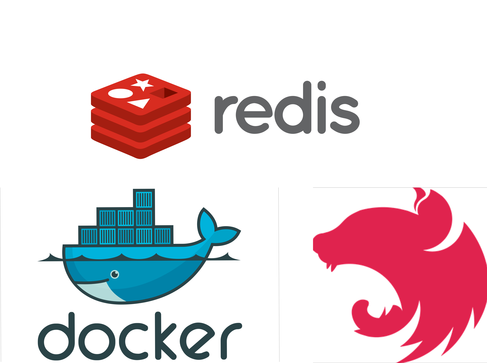

  

## What is this?

This is just a simple project that I developed ir order to study about Redis and how to dockerize a REST app using Docker to create containers through images of Postgres, Redis and image of the App.

## Stack

The stack used is Docker, Redis and Nest.js.

## How to run?

First of all, you have to install Docker on your machine - just if you haven't did it yet - and then open your terminal (bash, zsh, hyper etc.) in the directory that you've downloaded this project and run the command **docker compose up** (or **docker-compose up**).

Make sure to see the logs of the containers in order to find any errors or something like that.

## Extra

In the beggining of the process the _backend-cont_ will wait for _redis_ and _postgres_ containers initialize 100% and after that it will run some commands and one of these commands is **yarn prisma migrate reset -f**. This command will create a postgres database called **rest-redis**, create 3 tables (users, jobs and products) and it will seed this database creating 75k data in each of this 3 tables.

After all this docker initialization process you can access 6 routes, the first 3 routes are **users**, **jobs** and **products** and in these endpoint all the data will be fetch directly from database and it maybe can be slow but after that you can access another 3 routes just typing "**/redis**" in each of those 3 previous routes that i presented to you. In these endpoints - the endpoints which have "**/redis**" in the route - all the data will be fetch from the database on the first access but after the first access all the data will be fetch from **Redis**.
